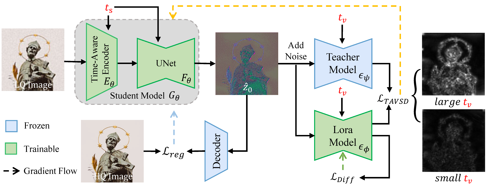

# :fire: Time-Aware One Step Diffusion Network for Real-World Image Super-Resolution

<a href='https://arxiv.org/abs/2508.16557'></a> &nbsp;&nbsp;
<a href='https://zty557.github.io/TADSR_HomePage/'></a> &nbsp;&nbsp;
<a href=''></a> &nbsp;&nbsp;


This is the official PyTorch codes for the paper

>**Time-Aware One Step Diffusion Network for Real-World Image Super-Resolution**<br>  [Tainyi Zhang<sup>1</sup>](), [Zhengpeng Duan<sup>1</sup>](), [Peng-Tao Jiang<sup>2</sup>](), [Bo Li Fu<sup>2</sup>](), [MingMing Cheng<sup>1</sup>](), [Chunle Guo<sup>1,3,&dagger;</sup>](), [Chongyi Li<sup>1,3</sup>]() <br>
> <sup>1</sup> VCIP, CS, Nankai University, <sup>2</sup> vivo Mobile Communication Co. Ltd. , <sup>3</sup> NKIARI, Shenzhen Futian<br>
>  <sup>&dagger;</sup>Corresponding author.




:star: If TADSR is helpful to your images or projects, please help star this repo. Thank you! :point_left:

---

## :boom: News

- **2025.08.25** Create this repo.

## :runner: TODO
- [x] Release training and inference code
- [x] Release Checkpoints


## 📜 License

This project is licensed under the Pi-Lab License 1.0 - see the [LICENSE](LICENSE) file for details.

## :book: Citation

If you find our repo useful for your research, please consider citing our paper:

```bibtex
@misc{zhang2025timeawarestepdiffusionnetwork,
    title={Time-Aware One Step Diffusion Network for Real-World Image Super-Resolution}, 
    author={Tainyi Zhang and Zheng-Peng Duan and Peng-Tao Jiang and Bo Li and Ming-Ming Cheng and Chun-Le Guo and Chongyi Li},
    year={2025},
    eprint={2508.16557},
    archivePrefix={arXiv},
    primaryClass={eess.IV},
    url={https://arxiv.org/abs/2508.16557}, 
}
```

## :postbox: Contact

For technical questions, please contact `zty557@gmail.com`
